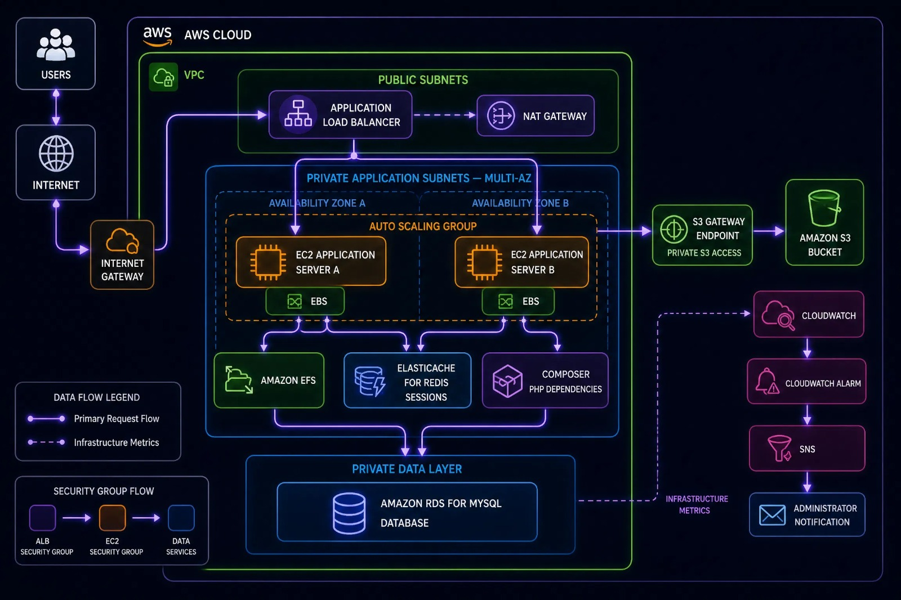

# CloudCart-Scalable-E-Commerce-Application-on-AWS
CloudCart is a scalable e-commerce application deployed on AWS, designed for high availability, scalability, and reliability using services such as EC2, ALB, Auto Scaling, RDS, ElastiCache, S3, EFS, and CloudWatch.

  

